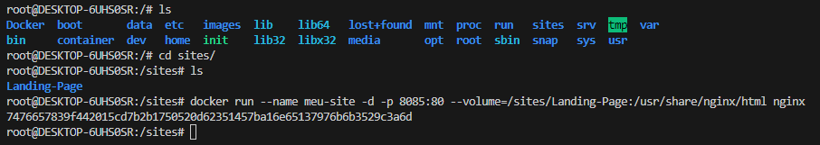
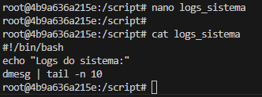
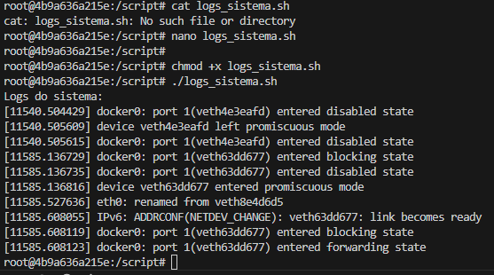
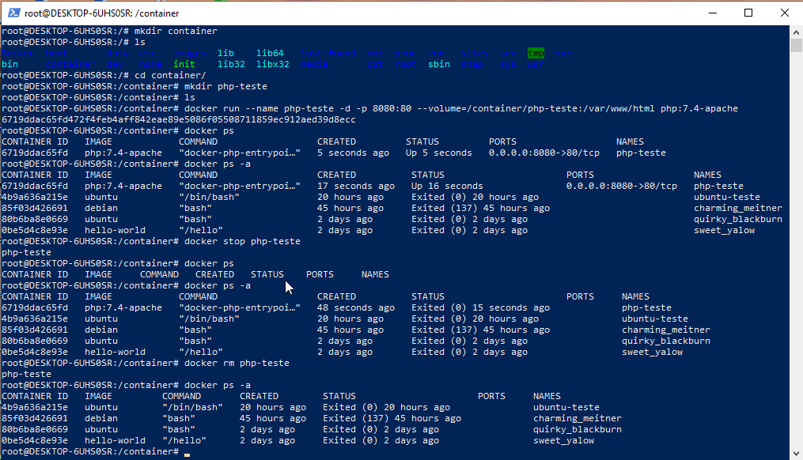
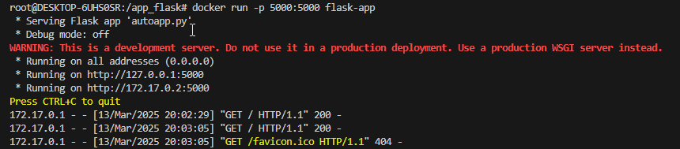
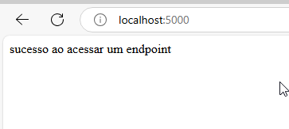

# Praticando Docker
1 - rodando um container basico:

crie uma pasta chamada sites, depois use o git clone https://github.com/tailwindtoolbox/Landing-Page.git para baixar o site diretametne do git hub.
execute o comando docker: ``` docker run --name meu-site -d -p 8085:80 --volume=/sites/Landing-Page:/usr/share/nginx/html nginx ```</br>


agora digite no navegador o ip do servidor+porta configurada exemplo: 192.168.0.103:8085 + enter </br>


2- Criando e rodando um container interativo

se nao tiver a imagem do ubuntu baixe com docker pull ubuntu.
execute um container para interagir com o comando: docker run --name ubuntu-teste -ti ubuntu /bin/bash
dentro do container crie uma pasta por exemplo script: atualize com apt update e instale o nano com apt install -y nano
depois execute o namo e crie um script exemplo: nano logs_sistema e escreva o script abaixo:

```
#!/bin/bash
echo "Logs do sistema:"
dmesg | tail -n 10
```

</br>


de permissão para executar: ``` chmod +x logs_sistema.sh ```

e execute o script: ./logs_sistema.sh



3 - Listando e removendo containers

primeiro vou criar um container para isto faça o seguinte: baixe uma versao do php com o comando docker pull php:7.4-apache
crie uma pasta com mkdir chamada container e dentro um diretorio php-teste, dentro do diretorio container execute :``` docker run --name php-teste -d -p 8080:80 --volume=/container/php-teste:/var/www/html php:7.4-apache```

verifique listando como docker ps (containers emexecução) e docker ps -a (para ver containers que foram executados), pare um container com docker stop + nome docontainer ou ID , pare o exemplo que criamos usando docker stop php-teste.
e para remover use ``` docker rm php-teste ```.



4- Criando um Dockerfile para uma aplicação simples em Python:

crie uma pasta com mkdir app_flask, dentro do diretorio crie o script python digitando nano autoapp.py e escreva ocodigo a seguir:
```
from flask import Flask
app = Flask(__name__)

@app.route('/')
def acesso_flask():
    return 'sucesso ao acessar um endpoint'
```

depois crie o arquivo txt "requirements.txt" escreva dentro:
```
Flask==2.2.2
Werkzeug==2.2.2
```
logo em seguida crie o dockerfile:

```
FROM python:3.9-slim
WORKDIR /app
COPY requirements.txt .
RUN pip install --no-cache-dir -r requirements.txt
COPY . .
EXPOSE 5000
ENV FLASK_APP=autoapp.py
CMD ["flask", "run", "--host=0.0.0.0"]
```

execute ocomando para criar a imagem:


``` docker build -t flask-app . ```
 
carregue  a aplicação: 

``` docker run -p 5000:5000 flask-app ```



acesse no nevgadordigitando <b> http://localhost:5000 </b>


